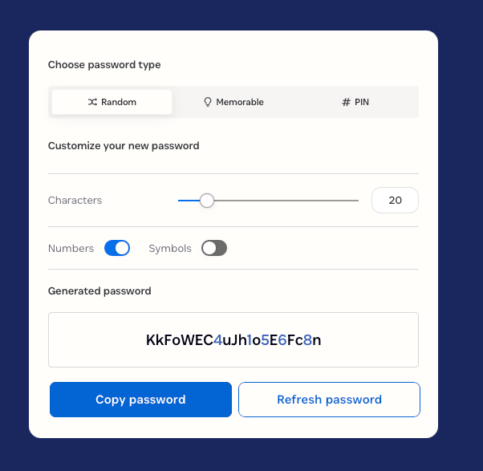

# Password Generator

- [Password Generator](https://1password.com/password-generator)

---

## Resources

- [Javascript tutorial](https://www.w3schools.com/js/default.asp)
- [MDN javascript tutorial](https://developer.mozilla.org/en-US/docs/Web/JavaScript)
- [Javascript Video Tutorial](https://youtu.be/W6NZfCO5SIk?si=qpKSKYV_00rLXGQp)

---

## Task

- [ ] Create a new folder under javascript/001.passwordGenerator
- [ ] Create a new branch based on main or upstream/main **_Don't forget to sync and fetch origin_**
- [ ] Use Html and css/bootstrap or tailwind css **_(similar to bootstrap but more powerful and lightweight)_** to create the UI
- [ ] Use javascript to manipulate to DOM elements of the UI
- [ ] Commit and create pull request
